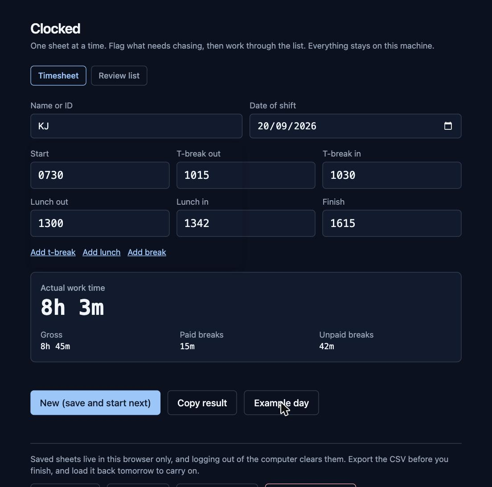
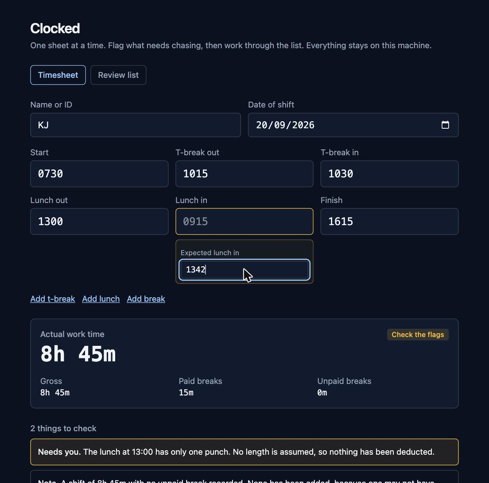
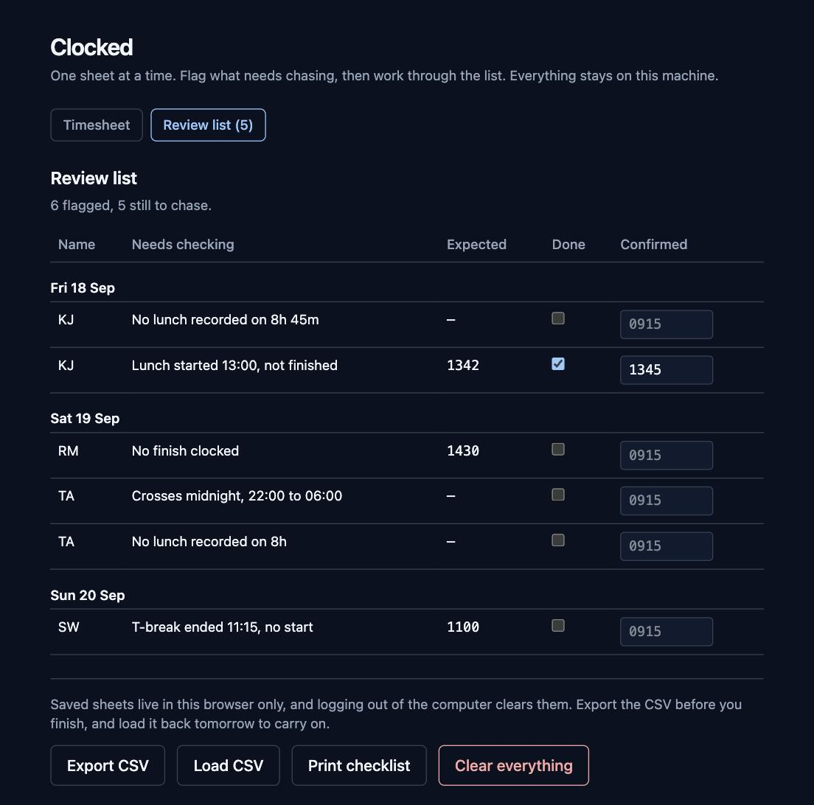

# Clocked

Clocked is a timesheet calculator. You type in a day's clockings and it tells you how long the person worked and how long their breaks ran, even when half the punches are missing.

**Status:** finished and live at [clocked.madebysami.app](https://clocked.madebysami.app), rebuilt from `main` on every push. 181 tests over the rules. Shipped 20 September 2026, three weeks ahead of the deadline.

## What problem does it solve?

Timesheets arrive incomplete. Someone forgets to clock out, or logs a lunch and never comes back from it. The arithmetic is easy. The judgement about the missing punch is where the errors and the arguments come from.

Most calculators assume clean input. Clocked expects the input to be wrong, flags what's missing, proposes a fix with the reason, and lets you override it. It never guesses silently.

## How does it treat breaks?

T-breaks are paid and lunch is unpaid. That's the only rule.

| Break | Paid? | Effect on work time |
| --- | --- | --- |
| T-break | Yes | None, however long it ran |
| Lunch | No | Deducted at its actual length |
| Other | No by default | Deducted unless you mark it paid |

No break has an expected length. Clocked won't tell you someone took too long, because that isn't its job. If a feature answers "did they take too long?" instead of "how long did they work?", it doesn't belong here.

## What happens when a punch is missing?

Every gap produces a flag and a proposed fix, with the reason in plain English. A total that rests on an assumption never looks the same as one that rests on real punches.

One case gets special care: Clocked will never invent an unpaid break. A missing clock out is almost certainly a system failure, so rebuilding it is fair. A missing lunch might mean nobody took lunch, and deducting time a person worked is the one mistake that costs them money.

## Is any data stored?

Only on your own machine, and only because losing a morning's work is worse.

There's no account and no backend. Nothing is ever sent anywhere. Saved sheets live in this browser's localStorage, and the CSV export is the only way data moves, moved by you.

That storage is not a safe place to leave anything. Logging out of a work machine usually clears site data, which takes the saved sheets with it. So the CSV is the real backup and localStorage is the convenience in between. Export before you finish, load it back the next morning, and carry on.

Use initials or IDs if you can. Real names stay out of the repo, the fixtures and the screenshots.

## What's the workflow?

The sheets you're reading from show raw clocked times and nothing else. No indication of which punch is an in or an out, and no indication of which are breaks. You supply that, Clocked does the arithmetic.

When somebody's forgotten to clock, you can't settle it at your desk. So you note what the time should have been and move on.

1. Type the name, the date and the punches
2. Anything missing is flagged, and a box appears to record the time you'd expect
3. **New** saves the sheet and clears the form for the next person
4. When you're through the stack, the **review list** has everything flagged, oldest shift first
5. Tick each one off as you chase it and record the time confirmed
6. Print it as a checklist, or export the CSV to carry on tomorrow

**Clear everything** deletes the lot, saved sheets and review list included. It asks first.

## How do I run it?

You'll need Node 24.

```bash
npm install
npm run dev
```

| Script | What it does |
| --- | --- |
| `npm run dev` | Dev server with hot reload |
| `npm test` | Runs the Vitest suite once |
| `npm run test:watch` | Vitest in watch mode |
| `npm run lint` | ESLint |
| `npm run build` | Type check, then a production build into `dist` |

## How is the code laid out?

```
src/
  engine/       Pure TypeScript. Punches and settings in, totals and flags out.
    time.ts     Parsing and formatting. Minutes since midnight, as integers.
    day.ts      The day model and the four derived totals.
    rules.ts    The gap rules. One flag per row of the table above.
    summary.ts  The copied result, as a single line.
  day/input.ts  What the form holds, and how it becomes a day.
  storage/      Saved sheets, kept in this browser only.
  review/       The review list, the CSV round trip, saving a file.
  fixtures/     Ten awkward days the engine has to survive.
  components/   The six fields, the totals, the flags, the review sheet.
  App.tsx       The single page.
  index.css     Tailwind and the design tokens.
```

The engine is a pure function with no React in it. Times are integer minutes since midnight, so there's no date library and no floating point. It takes one day and returns one result, which means a week view later is a loop over it.

## Milestones

Version 1 is done. The two unticked items are deliberate, not forgotten.

- [x] Rules engine, one test per row of the gap table
- [x] Single page form with live totals and flags
- [x] Extra break rows and the Clear control
- [x] Copy result and example day
- [x] Ten fixture days, one per awkward shape, covering every gap rule
- [ ] Replace those fixtures with real anonymised days from a sheet
- [x] Save sheets, flag what needs chasing, review list, CSV round trip
- [x] Works offline without a connection
- [ ] Accessibility pass. Desktop only, so phone layout is out of scope
- [x] Deployed on Netlify, building from `main`
- [x] Custom domain pointed at it
- [x] This README rewritten as the case study

## Case study

### The problem

Timesheets arrive incomplete. Somebody forgets to clock out, or logs a lunch and never comes back from it. The arithmetic is trivial. The judgement about the missing punch is not, and that's where the errors and the arguments come from.

The sheets being read from show raw clocked times and nothing else. No indication of which punch is an in or an out, no indication of which times are breaks. A person supplies that reading, every time, for every sheet in the stack.

### What I built

A single page that takes one day's punches and gives back four numbers and a list of what it couldn't work out. The rule that shapes everything: t-breaks are paid and never move the total, lunch is unpaid and comes off at its real length. No break has an expected length, because the moment you define one you're answering "did they take too long?" instead of "how long did they work?".

The second rule matters more. Clocked never invents an unpaid break. A missing clock out is almost certainly a system failure, so saying so is fair. A missing lunch might mean nobody took one, and deducting time somebody actually worked is the one mistake that costs them money. So it flags, and a human decides.

### How I built it

Engine first, with no React anywhere near it. Punches and settings in, totals and flags out. Times are integer minutes since midnight, so there's no date library and no floating point, and a shift crossing midnight is one modulo rather than a special case.

The gap handling table from the spec became one test per row. Ten fixture days cover every shape a real sheet arrives in: a missing clock out, an unclosed lunch, a night shift, overlapping breaks, an eighteen hour entry that can only be a typo.

Writing the engine first meant the interesting decisions were made before any of them were load bearing. Whether `9` means 09:00, whether `2400` is a time, what a paid break overlapping an unpaid one is worth. Each one is a test with the reasoning next to it.

### What it looks like

A day that adds up:



The same day with the lunch never clocked back in. Nothing is deducted, the total says so, and there's a box to record the time it should have been:



The review list, worked through once the stack is done. Grouped by shift date, printable as a checklist:



### What I'd do differently

The form shape was the wrong call, and it was mine. Six fixed fields mirror the paper, which made the UI binding trivial, but every gap rule then had to cope with two kinds of break: the named ones and the extra rows. An ordered list of punches would have been one code path. I flattened the six fields into a list inside the engine to get most of it back, which works, but it's a patch over a decision rather than the decision.

The fixtures are invented. They cover the right shapes, but a day that genuinely broke a spreadsheet is worth more than ten I thought up, and swapping them in is still on the list.

### The details

| | |
| --- | --- |
| Goal | Remove manual timesheet arithmetic and rebuild missing punches in the open, without policing anyone |
| My contribution | Sole designer and developer |
| Method | Rules engine first, one test per row of the gap handling table, ten fixture days |
| Deliverables | Live app, public repo, 181 tests, screenshots of a completed day, a flagged day and the review list |
| Skills | React, TypeScript, state design, testing, accessibility, offline web apps |
| Resources | React, TypeScript, Vite, Tailwind, Vitest, Netlify |
| Link | [clocked.madebysami.app](https://clocked.madebysami.app) |
| Completion date | September 2026 |
| Visual | The three screenshots above |

## Licence

MIT. See [LICENSE](LICENSE).
